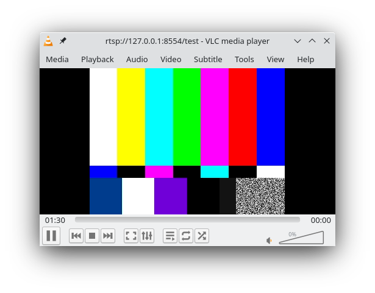

## Introduction to GStreamer

This is a very good introduction to GStreamer.

[Video Streaming Made Awesome with GStreamer and Python - sunhacks 2020 Talk](https://youtu.be/HDY8pf-b1nA)
[The text version of my GStreamer talk at sunhacks 2020](https://gist.github.com/velovix/8cbb9bb7fe86a08fb5aa7909b2950259)

Make sure that the following packages are installed on your system. `gstreamer, gst-rtsp-server`.
On Manjaro Linux they can be simple installed with pacman.

Before you can install PyGObject (gi) with pip, you need to install the following packages on your system.
```bash
sudo pacman -S python cairo pkgconf gobject-introspection gtk3
```

Open a terminal and enter your virtual environment. Install `pycairo` and `PyGObject`.

```bash
pip3 install pycairo
pip3 install PyGObject
```

Run the sample python script.
```bash
python3 basic.py
```

Open a terminal and connect to the rtsp stream.
```bash
vlc rtsp://127.0.0.1:8554/test
```

You should see test video.



Check


## On Debian / Ubuntu
```bash
sudo apt install gstreamer1.0-x gstreamer1.0-tools gstreamer1.0-plugins-good gstreamer1.0-plugins-bad gstreamer1.0-alsa
sudo apt install gir1.2-gst-rtsp-server-1.0
sudo apt install libgirepository1.0-dev
sudo apt install libcairo2-dev
```

## Find your camera
You can use the following command to list your cameras connect to your pc.
```bash
v4l2-ctl --list-devices

# Output
Video Capture 3 (usb-0000:00:06.0-2):
        /dev/video0
        /dev/video1
        /dev/media0

Video Capture 3 (usb-0000:00:06.0-3):
        /dev/video2
        /dev/video3
        /dev/media1
```

## List Formats supported by your camera (two techniques)
```bash
ffmpeg -f v4l2 -list_formats all -i /dev/video0

# Output
ffmpeg version n4.4.1 Copyright (c) 2000-2021 the FFmpeg developers
  built with gcc 11.1.0 (GCC)
  configuration: --prefix=/usr --disable-debug --disable-static --disable-stripping --enable-amf --enable-avisynth --enable-cuda-llvm --enable-lto --enable-fontconfig --enable-gmp --enable-gnutls --enable-gpl --enable-ladspa --enable-libaom --enable-libass --enable-libbluray --enable-libdav1d --enable-libdrm --enable-libfreetype --enable-libfribidi --enable-libgsm --enable-libiec61883 --enable-libjack --enable-libmfx --enable-libmodplug --enable-libmp3lame --enable-libopencore_amrnb --enable-libopencore_amrwb --enable-libopenjpeg --enable-libopus --enable-libpulse --enable-librav1e --enable-librsvg --enable-libsoxr --enable-libspeex --enable-libsrt --enable-libssh --enable-libsvtav1 --enable-libtheora --enable-libv4l2 --enable-libvidstab --enable-libvmaf --enable-libvorbis --enable-libvpx --enable-libwebp --enable-libx264 --enable-libx265 --enable-libxcb --enable-libxml2 --enable-libxvid --enable-libzimg --enable-nvdec --enable-nvenc --enable-shared --enable-version3
  libavutil      56. 70.100 / 56. 70.100
  libavcodec     58.134.100 / 58.134.100
  libavformat    58. 76.100 / 58. 76.100
  libavdevice    58. 13.100 / 58. 13.100
  libavfilter     7.110.100 /  7.110.100
  libswscale      5.  9.100 /  5.  9.100
  libswresample   3.  9.100 /  3.  9.100
  libpostproc    55.  9.100 / 55.  9.100
[video4linux2,v4l2 @ 0x555d87f6d0c0] Compressed:       mjpeg :          Motion-JPEG : 1280x720 160x120 176x144 320x240 352x288 640x480

################################################################

v4l2-ctl --list-formats-ext

# Output
ioctl: VIDIOC_ENUM_FMT
        Type: Video Capture

        [0]: 'MJPG' (Motion-JPEG, compressed)
                Size: Discrete 1280x720
                        Interval: Discrete 0.033s (30.000 fps)
                        Interval: Discrete 0.033s (30.000 fps)
                Size: Discrete 160x120
                        Interval: Discrete 0.033s (30.000 fps)
                Size: Discrete 176x144
                        Interval: Discrete 0.033s (30.000 fps)
                Size: Discrete 320x240
                        Interval: Discrete 0.033s (30.000 fps)
                Size: Discrete 352x288
                        Interval: Discrete 0.033s (30.000 fps)
                Size: Discrete 640x480
                        Interval: Discrete 0.033s (30.000 fps)
```

## Get detailed informations about your camera
```bash
v4l2-ctl --list-formats --all -d /dev/video0

# Output 
Driver Info:
        Driver name      : uvcvideo
        Card type        : Video Capture 3
        Bus info         : usb-0000:00:06.0-2
        Driver version   : 5.15.6
        Capabilities     : 0x84a00001
                Video Capture
                Metadata Capture
                Streaming
                Extended Pix Format
                Device Capabilities
        Device Caps      : 0x04200001
                Video Capture
                Streaming
                Extended Pix Format
Media Driver Info:
        Driver name      : uvcvideo
        Model            : VirtualBox Webcam - USB Camera:
        Serial           : c441ae3f829fec19
        Bus info         : usb-0000:00:06.0-2
        Media version    : 5.15.6
        Hardware revision: 0x00000100 (256)
        Driver version   : 5.15.6
Interface Info:
        ID               : 0x03000002
        Type             : V4L Video
Entity Info:
        ID               : 0x00000001 (1)
        Name             : Video Capture 3
        Function         : V4L2 I/O
        Flags            : default
        Pad 0x01000007   : 0: Sink
          Link 0x0200000d: from remote pad 0x100000a of entity 'Processing 2' (Video Pixel Formatter): Data, Enabled, Immutable
Priority: 2
Video input : 0 (Camera 1: ok)
Format Video Capture:
        Width/Height      : 640/480
        Pixel Format      : 'MJPG' (Motion-JPEG)
        Field             : None
        Bytes per Line    : 0
        Size Image        : 1228800
        Colorspace        : sRGB
        Transfer Function : Rec. 709
        YCbCr/HSV Encoding: ITU-R 601
        Quantization      : Default (maps to Full Range)
        Flags             : 
Crop Capability Video Capture:
        Bounds      : Left 0, Top 0, Width 640, Height 480
        Default     : Left 0, Top 0, Width 640, Height 480
        Pixel Aspect: 1/1
Selection Video Capture: crop_default, Left 0, Top 0, Width 640, Height 480, Flags: 
Selection Video Capture: crop_bounds, Left 0, Top 0, Width 640, Height 480, Flags: 
Streaming Parameters Video Capture:
        Capabilities     : timeperframe
        Frames per second: 30.000 (30/1)
        Read buffers     : 0
                     brightness 0x00980900 (int)    : min=0 max=100 step=1 default=50 value=50
ioctl: VIDIOC_ENUM_FMT
        Type: Video Capture

        [0]: 'MJPG' (Motion-JPEG, compressed)
```


## FFmpeg

If you are looking for some basic information about FFmpeg, check out the website from [RickMakes](https://www.rickmakes.com).
- [Using a Raspberry Pi Camera Board with FFmpeg](https://www.rickmakes.com/using-a-raspberry-pi-camera-board-with-ffmpeg/)
- [Streaming USB Webcam with FFmpeg from One Raspberry Pi to Another](https://www.rickmakes.com/streaming-usb-webcam-from-one-raspberry-pi-to-another/?unapproved=3898&moderation-hash=2a86a439c2a13f59542ac36d1233cd40#comment-3898)